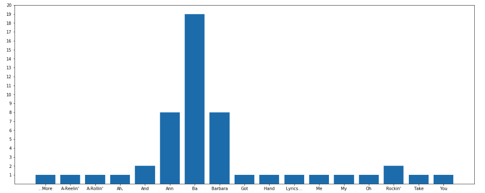

# Instant Data Science

When starting any course, you likely look at the syllabus to see what's covered and ask yourself if you can do it. In this lesson, we'll hope to give you a sense of how, with just a little bit of knowledge, you can make some real progress in using programs to answer questions with data.  

To do so, we will be introducing the following topics: 
* Data types: working with text and data 
* Variables: storing data
* Lists: working with data in an ordered collection
* Dictionaries: representing data as a collection of attributes   
* Loops and iteration: repeating a sequence of instructions  
* Data visualization: using plots to display data
* Functions: defining and running specific procedures in code 

This lesson will offer a brief glimpse into each of these topics. In the rest of the course, we will provide lessons and labs on each of these topics to break down the material step by step. Let's get started!

### Song Analysis

What makes a hit record?  Does repetitiveness help?  Is our music getting more repetitive over time?  Questions like these were asked by the great computer scientist Donald Knuth in 1977, and then they were asked again and answered, by Colin Morris in [this article](https://pudding.cool/2017/05/song-repetition/).

Here is a chart that Colin Morris produced showing some of the most repetitive popular artists.  How was something like this made and calculated?


After finishing the first section of our full-time data science curriculum, you will be able to produce the kind of data analysis you see in Colin Morris' article. Awesome, right?

### Analyzing one song

Let's take the song *Barbara Ann*, the most repetitive song of the Beach Boys which was remastered by the cast of *Saved by the Bell* in 1990.  


How did the cast learn all of the words so easily?  Repetition. Here are some of the lyrics.

    Ah, ba ba ba ba Barbara Ann
    Ba ba ba ba Barbara Ann

    Oh Barbara Ann take my hand
    Barbara Ann
    You got me rockin' and a-rollin'
    Rockin' and a-reelin'
    Barbara Ann ba ba
    Ba Barbara Ann

    ...more lyrics...

    Ba ba ba ba Barbara Ann
    Ba ba ba ba Barbara Ann

It keeps going, but you get the point.  Now let's say that we wanted to count up how many times each word in the above selection appears.  Without a computer, we could do the following: 

* Place each of the words on a separate index card
* Designate a spot for each unique word in our index cards
* Then, flip through the index cards one by one
* While flipping through each index card, find its designated pile and increase the size by one


Let's call these steps above **our plan**.  At the end of this lesson and after completing each step of our above plan, we will have a chart, like the one below, giving us a visualization of the most repetitious words in the Beach Boys' song, *Barbara Ann*. 



Great! Now let's translate our plan into code and make our chart!

### Strings and Variables

To solve this problem with code, we do something similar.  We start with our words in a **string**, which is a data structure that represents text.  This is how it looks:


```python
"Ah, Ba Ba Ba Ba Barbara Ann Ba Ba Ba Ba Barbara Ann Oh Barbara Ann Take My Hand Barbara Ann You Got Me Rockin' And A-Rollin' Rockin' And A-Reelin' Barbara Ann Ba Ba Ba Barbara Ann ...More Lyrics... Ba Ba Ba Ba Barbara Ann Ba Ba Ba Ba Barbara Ann"
```


    "Ah, Ba Ba Ba Ba Barbara Ann Ba Ba Ba Ba Barbara Ann Oh Barbara Ann Take My Hand Barbara Ann You Got Me Rockin' And A-Rollin' Rockin' And A-Reelin' Barbara Ann Ba Ba Ba Barbara Ann ...More Lyrics... Ba Ba Ba Ba Barbara Ann Ba Ba Ba Ba Barbara Ann"


> **Note:** What you see above in the first gray box is Python code.  The content in this box is the code you would write.  What comes below this first box is the **output** of running the code.  So the output of creating a string, is just that same string - not very interesting. 

To create a **string** in Python, notice that we place quotes at the start and end of text.  If we don't do this, Python will give us an error.

So, to avoid errors, we need quotes around our text to make a string, but to hold on to this string and reference it later, we assign it to a **variable**. We call it `lyrics`.  


```python
lyrics = "Ah, Ba Ba Ba Ba Barbara Ann Ba Ba Ba Ba Barbara Ann Oh Barbara Ann Take My Hand Barbara Ann You Got Me Rockin' And A-Rollin' Rockin' And A-Reelin' Barbara Ann Ba Ba Ba Barbara Ann ...More Lyrics... Ba Ba Ba Ba Barbara Ann Ba Ba Ba Ba Barbara Ann"
```

Now whenever we type the word `lyrics` into Python we reference our string.

```python 
lyrics
```

```python
"Ah, Ba Ba Ba Ba Barbara Ann Ba Ba Ba Ba Barbara Ann Oh Barbara Ann Take My Hand Barbara Ann You Got Me Rockin' And A-Rollin' Rockin' And A-Reelin' Barbara Ann Ba Ba Ba Barbara Ann ...More Lyrics... Ba Ba Ba Ba Barbara Ann Ba Ba Ba Ba Barbara Ann"
```

Okay, great. We now have our lyrics assigned to our variable, `lyrics` and we can use that to reference the string later in our code.  If we remember **our plan**, the first step was to place each word on a separate index card, but strings are **not** good at separating our text into individual words.  For that, we need a new data structure called a **list**.

### Lists

To separate our string into a list of individual words, we need to change this continuous string into a Python `list`.  Here is how we tell the computer to do this: split the string into a different entity every time you see a space.  Here are those directions in code.

> **Note:** we are going to be using methods like `split` and `len` throughout this lesson. Don't worry, we will explain what these methods do in later lessons. For now, focus on following the logic of what the inputs are doing.
   


```python
list_of_lyrics = lyrics.split(' ')
```

Ok, let's see what `list_of_lyrics` looks like.

```python 
list_of_lyrics
```

```python
['Ah,', 'Ba', 'Ba', 'Ba', 'Ba', 'Barbara', 'Ann', 'Ba', 'Ba', 'Ba', 'Ba', 'Barbara', 'Ann', 'Oh', 'Barbara', 'Ann', 'Take', 'My', 'Hand', 'Barbara', 'Ann', 'You', 'Got', 'Me', "Rockin'", 'And', "A-Rollin'", "Rockin'", 'And', "A-Reelin'", 'Barbara', 'Ann', 'Ba', 'Ba', 'Ba', 'Barbara', 'Ann', '...More', 'Lyrics...', 'Ba', 'Ba', 'Ba', 'Ba', 'Barbara', 'Ann', 'Ba', 'Ba', 'Ba', 'Ba', 'Barbara', 'Ann']
```

Ok, so this is a `list`. It's an ordered collection, and as you can see we are now treating each word as an individual **entity**. Each individual entity of a list is called an element. How many elements are there in this `list`?


```python
len(list_of_lyrics)
```


    51


Ok, but remember the second step of our plan was to allocate space for each unique word. Now that we have a list of all words, let's make a list of the unique words.


```python
unique_words = set(list_of_lyrics)
```

`unique_words` looks like this:

```python
{'...More', "A-Reelin'", "A-Rollin'", 'Ah,', 'And', 'Ann', 'Ba', 'Barbara', 'Got', 'Hand', 
 'Lyrics...', 'Me', 'My', 'Oh', "Rockin'", 'Take', 'You'}
```

Ok, you may have noticed that our list of unique words is significantly smaller than our total list of words.  How much smaller?


```python
len(unique_words)
```


    17


A lot.

So, there's a lot of repetition in `Barbara Ann`.  It's time to keep track of each word and the number of occurrences of each word.

### Sets vs Lists

Our ultimate goal is to present our list of repetitions almost as a table, with a (unique) word to the left and the number of occurrences to the right.  

| unique_words        | count           |
| ------------- |:-------------:|
| Ann     | 2 |
| Barbara     | 3 |
| Ba     | 8 |

You already have a collection with the unique words: 


```python
unique_words
```


    ['Ah,',
     'Hand',
     'You',
     "Rockin'",
     'Ba',
     'Barbara',
     'Take',
     'Me',
     'And',
     'Got',
     "A-Rollin'",
     "A-Reelin'",
     '...More',
     'Lyrics...',
     'Ann',
     'Oh',
     'My']


One small technicality about this `unique_words`-collection is that it is currently in a _set_ (which is why this collection has the curly brackets `{}`. One of the properties of a _set_ is that the order of the elements in the set doesn't matter. What does that mean? Let's look at a simple example. `set_1` and `set_2` below are two sets, which contain the same elements (1, 2 and 3). 


```python
set_1 = set({1,2,3})
set_2 = set({2,1,3})
```

Despite their different ordering, these two sets are identical! How can we tell? Let's compare them (comparing in Python can be done by using `==`.


```python
set_1 == set_2
```


    True


Python tells us that these sets are identical! Wow! What about lists? Let's have a look:


```python
list_1 = list([1,2,3])
list_2 = list([1,3,2])

list_1 == list_2
```


    False


The order matters for lists! Why does this matter to us? One of the steps in **our plan** was:

> - Designate a spot for each unique word in our index cards

We need to make sure our order of unique words is fixed, because we will start matching a value to it (the value being equal to how often the word occurs in the song). So let's convert our `unique_words`-set to a list. We can do this by using one simple line of code:


```python
unique_words = list(unique_words)
```

### Loops

Next up, you'll want to create a collection holding the number of occurrences for each of these words (the `count`). How do we get there?

Ok, now we have two nice data structures. A `list_of_lyrics` of all of our words, and `unique_words` with each word only occurring once. It seems like we're making good progress. Let's look again at our plan.

* Place each of the words on a separate index card. 
    * **Complete** as `list_of_lyrics`
* Designate a spot for each unique word in our index cards
    * **Complete** as `unique_words`
* Then, go through the index cards one by one
* And for each index card, increase the size of its related pile by one

So looking through the steps, all that's left are the last two steps.

In Python, to go through elements of a list one by one, we use a `for` loop.


```python
for number in [1,2,3]:
    print(number + 10)
```

    11
    12
    13


Ok, so here we want to go through the elements of our `list_of_lyrics` one by one. For each word in `unique_words`, we want to count how many times it occurs in `list_of_lyrics`. 

> **Deep breath** These next lines of code may look like magic.  The lessons that follow will explain them.


```python
count = []
for word in unique_words:
    count.append(list_of_lyrics.count(word))
```

In human language, this is what happened:

> You used your `list_of_lyrics` and looked at each word in your `unique_words`-list and counted (method `.count()`, you'll learn more on that in future lessons) how often time this word occured in your `list_of_lyrics`! To store the result, you started off by creating an empty list (using `[]`) and use .append() to add new numbers in each iteration of your loop.

We said it would be slightly confusing.  Good thing there are more lessons to explain it.  Let's see if it worked.


```python
count
```


    [1, 1, 1, 2, 19, 8, 1, 1, 2, 1, 1, 1, 1, 1, 8, 1, 1]


Let's now look at `unique_words` again. 


```python
unique_words
```


    ['Ah,',
     'Hand',
     'You',
     "Rockin'",
     'Ba',
     'Barbara',
     'Take',
     'Me',
     'And',
     'Got',
     "A-Rollin'",
     "A-Reelin'",
     '...More',
     'Lyrics...',
     'Ann',
     'Oh',
     'My']


Some observations:

- The 4th word in your `unique_words` list ("Rockin'") occurs _twice_, so the 4th element of `unique_words` is 2! 
- "Ba" is the most common word, occurring 19 times. 

It looks like our for loop worked!

### Visualizing the data

We've got our answer in code.  The final step is to turn it into a chart.  We'll use a library -- which is a collection of code that allows you to perform many actions without having to write a ton of lines of code that does not come with Python -- called `matplotlib` to make our charts.

If you do not have Matplotlib installed, you can install it using:


```python
!pip install matplotlib=3.1.1
```

In the two lines we tell Python to get ready to use this library.  And in the last line we tell Python to show the plot.

The third line of code sets the size of the figure. If you don't set the figure size, your figure will be pretty small and hard to read. The fourth line is the meat of the code, mapping the `unique_words`-list to the respective `count`, using a bar plot. We then set the y-ticks, so our y-axis is readable and clearly states the respective count.

```python
import matplotlib.pyplot as plt
%matplotlib inline

plt.figure(figsize=(18,8))
plt.bar(unique_words, count, width = 0.8)
plt.yticks(range(1,21))
plt.show()
```


We have now plotted our words! We can see that The Beach Boys say "Ba" 19 times, and remember that we only copied over some of the lyrics!  Repetitive indeed.

### Summary

Hopefully, in this section you can see that even with just a bit of knowledge we can really put code to use. It may have seemed like a lot of work, but the work was in the learning, not the code.  

All of the code written so far was really just seven lines of code plus another six lines to plot our chart, giving us a grand total of a mere 13 lines of code! 

In the following sections, we will cover the topics we introduced in this lesson and more, so that we can begin use the tools above to explore information with code.
